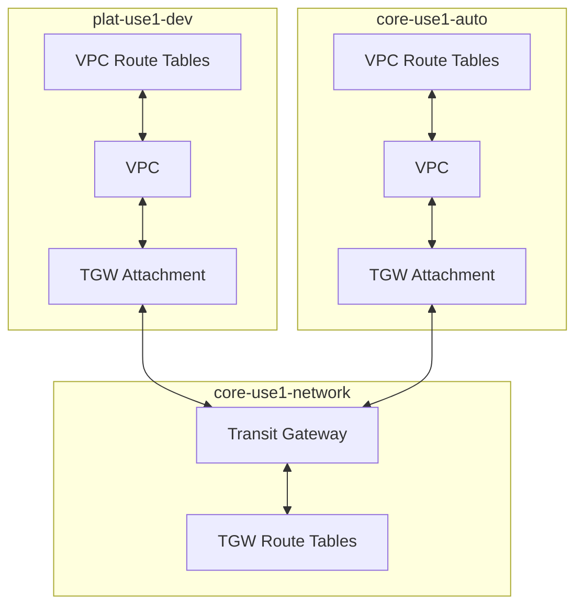

<!-- markdownlint-disable -->
<a href="https://cpco.io/homepage"></a><br/>
    <p align="right">
<a href="https://github.com/cloudposse-terraform-components/aws-tgw-hub/releases/latest"></a><a href="https://slack.cloudposse.com"></a></p>
<!-- markdownlint-restore -->

<!--


  ** DO NOT EDIT THIS FILE
  **
  ** This file was automatically generated by the `cloudposse/build-harness`.
  ** 1) Make all changes to `README.yaml`
  ** 2) Run `make init` (you only need to do this once)
  ** 3) Run`make readme` to rebuild this file.
  **
  ** (We maintain HUNDREDS of open source projects. This is how we maintain our sanity.)
  **


-->

This component is responsible for provisioning an [AWS Transit Gateway](https://aws.amazon.com/transit-gateway) `hub`
that acts as a centralized gateway for connecting VPCs from other `spoke` accounts.


> [!TIP]
> #### 👽 Use Atmos with Terraform
> Cloud Posse uses [`atmos`](https://atmos.tools) to easily orchestrate multiple environments using Terraform. <br/>
> Works with [Github Actions](https://atmos.tools/integrations/github-actions/), [Atlantis](https://atmos.tools/integrations/atlantis), or [Spacelift](https://atmos.tools/integrations/spacelift).
>
> <details>
> <summary><strong>Watch demo of using Atmos with Terraform</strong></summary>
> <br/>
> <i>Example of running <a href="https://atmos.tools"><code>atmos</code></a> to manage infrastructure from our <a href="https://atmos.tools/quick-start/">Quick Start</a> tutorial.</i>
> </detalis>


## Usage


**Stack Level**: Regional

## Basic Usage with `tgw/spoke`

Here's an example snippet for how to configure and use this component:

```yaml
components:
  terraform:
    tgw/hub/defaults:
      metadata:
        type: abstract
        component: tgw/hub
      vars:
        enabled: true
        name: tgw-hub
        expose_eks_sg: false
        tags:
          Team: sre
          Service: tgw-hub

    tgw/hub:
      metadata:
        inherits:
          - tgw/hub/defaults
        component: tgw/hub
      vars:
        connections:
          - account:
              tenant: core
              stage: network
            vpc_component_names:
              - vpc-dev
          - account:
              tenant: core
              stage: artifacts
          - account:
              tenant: core
              stage: auto
            eks_component_names:
              - eks/cluster
          - account:
              tenant: plat
              stage: dev
            vpc_component_names:
              - vpc
              - vpc/data/1
            eks_component_names:
              - eks/cluster
          - account:
              tenant: plat
              stage: staging
            vpc_component_names:
              - vpc
              - vpc/data/1
            eks_component_names:
              - eks/cluster
          - account:
              tenant: plat
              stage: prod
            vpc_component_names:
              - vpc
              - vpc/data/1
            eks_component_names:
              - eks/cluster
```

To provision the Transit Gateway and all related resources, run the following commands:

```sh
atmos terraform plan tgw/hub -s <tenant>-<environment>-network
atmos terraform apply tgw/hub -s <tenant>-<environment>-network
```

## Alternate Usage with `tgw/attachment`, `tgw/routes`, and `vpc/routes`

### Components Overview

- **`tgw/hub`**: Creates the Transit Gateway in the network account
- **`tgw/attachment`**: Creates and manages Transit Gateway VPC attachments in connected accounts
- **`tgw/hub-connection`**: Creates the Transit Gateway peering connection between two `tgw/hub` deployments
- **`tgw/routes`**: Manages Transit Gateway route tables in the network account
- **`vpc-routes`** (`vpc/routes/private`): Configures VPC route tables in connected accounts to route traffic through the Transit Gateway (Note: This component lives outside the `tgw/` directory since it's not specific to Transit Gateway)

### Architecture

The Transit Gateway components work together in the following way:

1. Transit Gateway is created in the network account (`tgw/hub`)
2. VPCs in other accounts attach to the Transit Gateway (`tgw/attachment`)
3. Route tables in connected VPCs direct traffic across accounts (`vpc-routes`)
4. Transit Gateway route tables control routing between attachments (`tgw/routes`)



### Deployment Steps

#### 1. Deploy Transit Gateway Hub

First, create the Transit Gateway in the network account.

> [!TIP]
> Leave `var.connections` empty. With this refactor, the `tgw/hub` component is only responsible for creating the Transit Gateway and its route tables. We do not need to fetch and store outputs for the connected components anymore.

```yaml
components:
  terraform:
    tgw/hub:
      vars:
        connections: []
```

#### 2. Deploy VPC Attachments

Important: Deploy attachments in connected accounts first, before deploying attachments in the network account.

##### Connected Account Attachments

```yaml
components:
  terraform:
    tgw/attachment:
      vars:
        transit_gateway_id: !terraform.output tgw/hub core-use1-network transit_gateway_id
        transit_gateway_route_table_id: !terraform.output tgw/hub core-use1-network transit_gateway_route_table_id
        create_transit_gateway_route_table_association: false
```

##### Network Account Attachment

```yaml
components:
  terraform:
    tgw/attachment:
      vars:
        transit_gateway_id: !terraform.output tgw/hub core-use1-network transit_gateway_id
        transit_gateway_route_table_id: !terraform.output tgw/hub core-use1-network transit_gateway_route_table_id

        # Route table associations are required so that route tables can propagate their routes to other route tables.
        # Set the following to true in the same account where the Transit Gateway and its route tables are deployed
        create_transit_gateway_route_table_association: true

        # Associate connected accounts with the Transit Gateway route table
        additional_associations:
          - attachment_id: !terraform.output tgw/attachment core-use1-auto transit_gateway_vpc_attachment_id
            route_table_id: !terraform.output tgw/hub transit_gateway_route_table_id
          - attachment_id: !terraform.output tgw/attachment plat-use1-dev transit_gateway_vpc_attachment_id
            route_table_id: !terraform.output tgw/hub transit_gateway_route_table_id
```

#### 3. Configure VPC Routes

Configure routes in all connected VPCs.

```yaml
components:
  terraform:
    vpc/routes/private:
      metadata:
        component: vpc-routes
      vars:
        route_table_ids: !terraform.output vpc private_route_table_ids
        routes:
          # Route to network account
          - destination:
              cidr_block: !terraform.output vpc core-use1-network vpc_cidr
            target:
              type: transit_gateway_id
              value: !terraform.output tgw/hub core-use1-network transit_gateway_id

          # Route to core-auto account, if necessary
          - destination:
              cidr_block: !terraform.output vpc core-use1-auto vpc_cidr
            target:
              type: transit_gateway_id
              value: !terraform.output tgw/hub core-use1-network transit_gateway_id
```

Configure routes in the Network Account VPCs.

```yaml
components:
  terraform:
    vpc/routes/private:
      vars:
        route_table_ids: !terraform.output vpc private_route_table_ids
        routes:
          # Routes to connected accounts
          - destination:
              cidr_block: !terraform.output vpc core-use1-auto vpc_cidr
            target:
              type: transit_gateway_id
              value: !terraform.output tgw/hub transit_gateway_id
          - destination:
              cidr_block: !terraform.output vpc plat-use1-dev vpc_cidr
            target:
              type: transit_gateway_id
              value: !terraform.output tgw/hub transit_gateway_id
```

### 4. Deploy Transit Gateway Route Table Routes

Deploy the `tgw/routes` component in the network account to create route tables and routes.

```yaml
components:
  terraform:
    tgw/routes:
      vars:
        transit_gateway_route_table_id: !terraform.output tgw/hub transit_gateway_route_table_id
        # Use propagated routes to route through VPC attachments
        propagated_routes:
          # Route to this account
          - attachment_id: !terraform.output tgw/attachment core-use1-network transit_gateway_attachment_id
          # Route to any connected account
          - attachment_id: !terraform.output tgw/attachment core-use1-auto transit_gateway_attachment_id
          - attachment_id: !terraform.output tgw/attachment plat-use1-dev transit_gateway_attachment_id
```

> [!IMPORTANT]
> In Cloud Posse's examples, we avoid pinning modules to specific versions to prevent discrepancies between the documentation
> and the latest released versions. However, for your own projects, we strongly advise pinning each module to the exact version
> you're using. This practice ensures the stability of your infrastructure. Additionally, we recommend implementing a systematic
> approach for updating versions to avoid unexpected changes.


## Related Projects

Check out these related projects.

- [Cloud Posse Terraform Modules](https://docs.cloudposse.com/modules/) - Our collection of reusable Terraform modules used by our reference architectures.
- [Atmos](https://atmos.tools) - Atmos is like docker-compose but for your infrastructure


> [!TIP]
> #### Use Terraform Reference Architectures for AWS
>
> Use Cloud Posse's ready-to-go [terraform architecture blueprints](https://cloudposse.com/reference-architecture/) for AWS to get up and running quickly.
>
> ✅ We build it together with your team.<br/>
> ✅ Your team owns everything.<br/>
> ✅ 100% Open Source and backed by fanatical support.<br/>
>
> <a href="https://cpco.io/commercial-support?utm_source=github&utm_medium=readme&utm_campaign=cloudposse-terraform-components/aws-tgw-hub&utm_content=commercial_support"></a>
> <details><summary>📚 <strong>Learn More</strong></summary>
>
> <br/>
>
> Cloud Posse is the leading [**DevOps Accelerator**](https://cpco.io/commercial-support?utm_source=github&utm_medium=readme&utm_campaign=cloudposse-terraform-components/aws-tgw-hub&utm_content=commercial_support) for funded startups and enterprises.
>
> *Your team can operate like a pro today.*
>
> Ensure that your team succeeds by using Cloud Posse's proven process and turnkey blueprints. Plus, we stick around until you succeed.
> #### Day-0:  Your Foundation for Success
> - **Reference Architecture.** You'll get everything you need from the ground up built using 100% infrastructure as code.
> - **Deployment Strategy.** Adopt a proven deployment strategy with GitHub Actions, enabling automated, repeatable, and reliable software releases.
> - **Site Reliability Engineering.** Gain total visibility into your applications and services with Datadog, ensuring high availability and performance.
> - **Security Baseline.** Establish a secure environment from the start, with built-in governance, accountability, and comprehensive audit logs, safeguarding your operations.
> - **GitOps.** Empower your team to manage infrastructure changes confidently and efficiently through Pull Requests, leveraging the full power of GitHub Actions.
>
> <a href="https://cpco.io/commercial-support?utm_source=github&utm_medium=readme&utm_campaign=cloudposse-terraform-components/aws-tgw-hub&utm_content=commercial_support"></a>
>
> #### Day-2: Your Operational Mastery
> - **Training.** Equip your team with the knowledge and skills to confidently manage the infrastructure, ensuring long-term success and self-sufficiency.
> - **Support.** Benefit from a seamless communication over Slack with our experts, ensuring you have the support you need, whenever you need it.
> - **Troubleshooting.** Access expert assistance to quickly resolve any operational challenges, minimizing downtime and maintaining business continuity.
> - **Code Reviews.** Enhance your team’s code quality with our expert feedback, fostering continuous improvement and collaboration.
> - **Bug Fixes.** Rely on our team to troubleshoot and resolve any issues, ensuring your systems run smoothly.
> - **Migration Assistance.** Accelerate your migration process with our dedicated support, minimizing disruption and speeding up time-to-value.
> - **Customer Workshops.** Engage with our team in weekly workshops, gaining insights and strategies to continuously improve and innovate.
>
> <a href="https://cpco.io/commercial-support?utm_source=github&utm_medium=readme&utm_campaign=cloudposse-terraform-components/aws-tgw-hub&utm_content=commercial_support"></a>
> </details>

## ✨ Contributing

This project is under active development, and we encourage contributions from our community.


Many thanks to our outstanding contributors:

<a href="https://github.com/cloudposse-terraform-components/aws-tgw-hub/graphs/contributors">
  
</a>

For 🐛 bug reports & feature requests, please use the [issue tracker](https://github.com/cloudposse-terraform-components/aws-tgw-hub/issues).

In general, PRs are welcome. We follow the typical "fork-and-pull" Git workflow.
 1. Review our [Code of Conduct](https://github.com/cloudposse-terraform-components/aws-tgw-hub/?tab=coc-ov-file#code-of-conduct) and [Contributor Guidelines](https://github.com/cloudposse/.github/blob/main/CONTRIBUTING.md).
 2. **Fork** the repo on GitHub
 3. **Clone** the project to your own machine
 4. **Commit** changes to your own branch
 5. **Push** your work back up to your fork
 6. Submit a **Pull Request** so that we can review your changes

**NOTE:** Be sure to merge the latest changes from "upstream" before making a pull request!

### 🌎 Slack Community

Join our [Open Source Community](https://cpco.io/slack?utm_source=github&utm_medium=readme&utm_campaign=cloudposse-terraform-components/aws-tgw-hub&utm_content=slack) on Slack. It's **FREE** for everyone! Our "SweetOps" community is where you get to talk with others who share a similar vision for how to rollout and manage infrastructure. This is the best place to talk shop, ask questions, solicit feedback, and work together as a community to build totally *sweet* infrastructure.

### 📰 Newsletter

Sign up for [our newsletter](https://cpco.io/newsletter?utm_source=github&utm_medium=readme&utm_campaign=cloudposse-terraform-components/aws-tgw-hub&utm_content=newsletter) and join 3,000+ DevOps engineers, CTOs, and founders who get insider access to the latest DevOps trends, so you can always stay in the know.
Dropped straight into your Inbox every week — and usually a 5-minute read.

### 📆 Office Hours <a href="https://cloudposse.com/office-hours?utm_source=github&utm_medium=readme&utm_campaign=cloudposse-terraform-components/aws-tgw-hub&utm_content=office_hours"></a>

[Join us every Wednesday via Zoom](https://cloudposse.com/office-hours?utm_source=github&utm_medium=readme&utm_campaign=cloudposse-terraform-components/aws-tgw-hub&utm_content=office_hours) for your weekly dose of insider DevOps trends, AWS news and Terraform insights, all sourced from our SweetOps community, plus a _live Q&A_ that you can’t find anywhere else.
It's **FREE** for everyone!
## License

<a href="https://opensource.org/licenses/Apache-2.0"></a>

<details>
<summary>Preamble to the Apache License, Version 2.0</summary>
<br/>
<br/>


```text
Licensed to the Apache Software Foundation (ASF) under one
or more contributor license agreements.  See the NOTICE file
distributed with this work for additional information
regarding copyright ownership.  The ASF licenses this file
to you under the Apache License, Version 2.0 (the
"License"); you may not use this file except in compliance
with the License.  You may obtain a copy of the License at

  https://www.apache.org/licenses/LICENSE-2.0

Unless required by applicable law or agreed to in writing,
software distributed under the License is distributed on an
"AS IS" BASIS, WITHOUT WARRANTIES OR CONDITIONS OF ANY
KIND, either express or implied.  See the License for the
specific language governing permissions and limitations
under the License.
```
</details>

## Trademarks

All other trademarks referenced herein are the property of their respective owners.


---
Copyright © 2017-2025 [Cloud Posse, LLC](https://cpco.io/copyright)


<a href="https://cloudposse.com/readme/footer/link?utm_source=github&utm_medium=readme&utm_campaign=cloudposse-terraform-components/aws-tgw-hub&utm_content=readme_footer_link"></a>


<!-- BEGINNING OF PRE-COMMIT-TERRAFORM DOCS HOOK -->
## Requirements

| Name | Version |
|------|---------|
| <a name="requirement_terraform"></a> [terraform](#requirement\_terraform) | >= 1.0.0 |
| <a name="requirement_aws"></a> [aws](#requirement\_aws) | >= 4.1 |

## Providers

No providers.

## Modules

| Name | Source | Version |
|------|--------|---------|
| <a name="module_account_map"></a> [account\_map](#module\_account\_map) | cloudposse/stack-config/yaml//modules/remote-state | 1.5.0 |
| <a name="module_eks"></a> [eks](#module\_eks) | cloudposse/stack-config/yaml//modules/remote-state | 1.5.0 |
| <a name="module_iam_roles"></a> [iam\_roles](#module\_iam\_roles) | ../../account-map/modules/iam-roles | n/a |
| <a name="module_tgw_hub"></a> [tgw\_hub](#module\_tgw\_hub) | cloudposse/transit-gateway/aws | 0.11.0 |
| <a name="module_this"></a> [this](#module\_this) | cloudposse/label/null | 0.25.0 |
| <a name="module_vpc"></a> [vpc](#module\_vpc) | cloudposse/stack-config/yaml//modules/remote-state | 1.5.0 |

## Resources

No resources.

## Inputs

| Name | Description | Type | Default | Required |
|------|-------------|------|---------|:--------:|
| <a name="input_account_map_environment_name"></a> [account\_map\_environment\_name](#input\_account\_map\_environment\_name) | The name of the environment where `account_map` is provisioned | `string` | `"gbl"` | no |
| <a name="input_account_map_stage_name"></a> [account\_map\_stage\_name](#input\_account\_map\_stage\_name) | The name of the stage where `account_map` is provisioned | `string` | `"root"` | no |
| <a name="input_account_map_tenant_name"></a> [account\_map\_tenant\_name](#input\_account\_map\_tenant\_name) | The name of the tenant where `account_map` is provisioned.<br/><br/>If the `tenant` label is not used, leave this as `null`. | `string` | `null` | no |
| <a name="input_additional_tag_map"></a> [additional\_tag\_map](#input\_additional\_tag\_map) | Additional key-value pairs to add to each map in `tags_as_list_of_maps`. Not added to `tags` or `id`.<br/>This is for some rare cases where resources want additional configuration of tags<br/>and therefore take a list of maps with tag key, value, and additional configuration. | `map(string)` | `{}` | no |
| <a name="input_allow_external_principals"></a> [allow\_external\_principals](#input\_allow\_external\_principals) | Set true to allow the TGW to be RAM shared with external principals specified in ram\_principals | `bool` | `false` | no |
| <a name="input_attributes"></a> [attributes](#input\_attributes) | ID element. Additional attributes (e.g. `workers` or `cluster`) to add to `id`,<br/>in the order they appear in the list. New attributes are appended to the<br/>end of the list. The elements of the list are joined by the `delimiter`<br/>and treated as a single ID element. | `list(string)` | `[]` | no |
| <a name="input_connections"></a> [connections](#input\_connections) | A list of objects to define each TGW connections.<br/><br/>By default, each connection will look for only the default `vpc` component. | <pre>list(object({<br/>    account = object({<br/>      stage       = string<br/>      environment = optional(string, "")<br/>      tenant      = optional(string, "")<br/>    })<br/>    vpc_component_names = optional(list(string), ["vpc"])<br/>    eks_component_names = optional(list(string), [])<br/>  }))</pre> | `[]` | no |
| <a name="input_context"></a> [context](#input\_context) | Single object for setting entire context at once.<br/>See description of individual variables for details.<br/>Leave string and numeric variables as `null` to use default value.<br/>Individual variable settings (non-null) override settings in context object,<br/>except for attributes, tags, and additional\_tag\_map, which are merged. | `any` | <pre>{<br/>  "additional_tag_map": {},<br/>  "attributes": [],<br/>  "delimiter": null,<br/>  "descriptor_formats": {},<br/>  "enabled": true,<br/>  "environment": null,<br/>  "id_length_limit": null,<br/>  "label_key_case": null,<br/>  "label_order": [],<br/>  "label_value_case": null,<br/>  "labels_as_tags": [<br/>    "unset"<br/>  ],<br/>  "name": null,<br/>  "namespace": null,<br/>  "regex_replace_chars": null,<br/>  "stage": null,<br/>  "tags": {},<br/>  "tenant": null<br/>}</pre> | no |
| <a name="input_delimiter"></a> [delimiter](#input\_delimiter) | Delimiter to be used between ID elements.<br/>Defaults to `-` (hyphen). Set to `""` to use no delimiter at all. | `string` | `null` | no |
| <a name="input_descriptor_formats"></a> [descriptor\_formats](#input\_descriptor\_formats) | Describe additional descriptors to be output in the `descriptors` output map.<br/>Map of maps. Keys are names of descriptors. Values are maps of the form<br/>`{<br/>  format = string<br/>  labels = list(string)<br/>}`<br/>(Type is `any` so the map values can later be enhanced to provide additional options.)<br/>`format` is a Terraform format string to be passed to the `format()` function.<br/>`labels` is a list of labels, in order, to pass to `format()` function.<br/>Label values will be normalized before being passed to `format()` so they will be<br/>identical to how they appear in `id`.<br/>Default is `{}` (`descriptors` output will be empty). | `any` | `{}` | no |
| <a name="input_enabled"></a> [enabled](#input\_enabled) | Set to false to prevent the module from creating any resources | `bool` | `null` | no |
| <a name="input_environment"></a> [environment](#input\_environment) | ID element. Usually used for region e.g. 'uw2', 'us-west-2', OR role 'prod', 'staging', 'dev', 'UAT' | `string` | `null` | no |
| <a name="input_expose_eks_sg"></a> [expose\_eks\_sg](#input\_expose\_eks\_sg) | Set true to allow EKS clusters to accept traffic from source accounts | `bool` | `true` | no |
| <a name="input_id_length_limit"></a> [id\_length\_limit](#input\_id\_length\_limit) | Limit `id` to this many characters (minimum 6).<br/>Set to `0` for unlimited length.<br/>Set to `null` for keep the existing setting, which defaults to `0`.<br/>Does not affect `id_full`. | `number` | `null` | no |
| <a name="input_label_key_case"></a> [label\_key\_case](#input\_label\_key\_case) | Controls the letter case of the `tags` keys (label names) for tags generated by this module.<br/>Does not affect keys of tags passed in via the `tags` input.<br/>Possible values: `lower`, `title`, `upper`.<br/>Default value: `title`. | `string` | `null` | no |
| <a name="input_label_order"></a> [label\_order](#input\_label\_order) | The order in which the labels (ID elements) appear in the `id`.<br/>Defaults to ["namespace", "environment", "stage", "name", "attributes"].<br/>You can omit any of the 6 labels ("tenant" is the 6th), but at least one must be present. | `list(string)` | `null` | no |
| <a name="input_label_value_case"></a> [label\_value\_case](#input\_label\_value\_case) | Controls the letter case of ID elements (labels) as included in `id`,<br/>set as tag values, and output by this module individually.<br/>Does not affect values of tags passed in via the `tags` input.<br/>Possible values: `lower`, `title`, `upper` and `none` (no transformation).<br/>Set this to `title` and set `delimiter` to `""` to yield Pascal Case IDs.<br/>Default value: `lower`. | `string` | `null` | no |
| <a name="input_labels_as_tags"></a> [labels\_as\_tags](#input\_labels\_as\_tags) | Set of labels (ID elements) to include as tags in the `tags` output.<br/>Default is to include all labels.<br/>Tags with empty values will not be included in the `tags` output.<br/>Set to `[]` to suppress all generated tags.<br/>**Notes:**<br/>  The value of the `name` tag, if included, will be the `id`, not the `name`.<br/>  Unlike other `null-label` inputs, the initial setting of `labels_as_tags` cannot be<br/>  changed in later chained modules. Attempts to change it will be silently ignored. | `set(string)` | <pre>[<br/>  "default"<br/>]</pre> | no |
| <a name="input_name"></a> [name](#input\_name) | ID element. Usually the component or solution name, e.g. 'app' or 'jenkins'.<br/>This is the only ID element not also included as a `tag`.<br/>The "name" tag is set to the full `id` string. There is no tag with the value of the `name` input. | `string` | `null` | no |
| <a name="input_namespace"></a> [namespace](#input\_namespace) | ID element. Usually an abbreviation of your organization name, e.g. 'eg' or 'cp', to help ensure generated IDs are globally unique | `string` | `null` | no |
| <a name="input_ram_principals"></a> [ram\_principals](#input\_ram\_principals) | A list of AWS account IDs to share the TGW with outside the organization | `list(string)` | `[]` | no |
| <a name="input_regex_replace_chars"></a> [regex\_replace\_chars](#input\_regex\_replace\_chars) | Terraform regular expression (regex) string.<br/>Characters matching the regex will be removed from the ID elements.<br/>If not set, `"/[^a-zA-Z0-9-]/"` is used to remove all characters other than hyphens, letters and digits. | `string` | `null` | no |
| <a name="input_region"></a> [region](#input\_region) | AWS Region | `string` | n/a | yes |
| <a name="input_stage"></a> [stage](#input\_stage) | ID element. Usually used to indicate role, e.g. 'prod', 'staging', 'source', 'build', 'test', 'deploy', 'release' | `string` | `null` | no |
| <a name="input_tags"></a> [tags](#input\_tags) | Additional tags (e.g. `{'BusinessUnit': 'XYZ'}`).<br/>Neither the tag keys nor the tag values will be modified by this module. | `map(string)` | `{}` | no |
| <a name="input_tenant"></a> [tenant](#input\_tenant) | ID element \_(Rarely used, not included by default)\_. A customer identifier, indicating who this instance of a resource is for | `string` | `null` | no |

## Outputs

| Name | Description |
|------|-------------|
| <a name="output_eks"></a> [eks](#output\_eks) | Accounts with EKS and EKSs information |
| <a name="output_tgw_config"></a> [tgw\_config](#output\_tgw\_config) | Transit Gateway config |
| <a name="output_transit_gateway_arn"></a> [transit\_gateway\_arn](#output\_transit\_gateway\_arn) | Transit Gateway ARN |
| <a name="output_transit_gateway_id"></a> [transit\_gateway\_id](#output\_transit\_gateway\_id) | Transit Gateway ID |
| <a name="output_transit_gateway_route_table_id"></a> [transit\_gateway\_route\_table\_id](#output\_transit\_gateway\_route\_table\_id) | Transit Gateway route table ID |
| <a name="output_vpcs"></a> [vpcs](#output\_vpcs) | Accounts with VPC and VPCs information |
<!-- END OF PRE-COMMIT-TERRAFORM DOCS HOOK -->